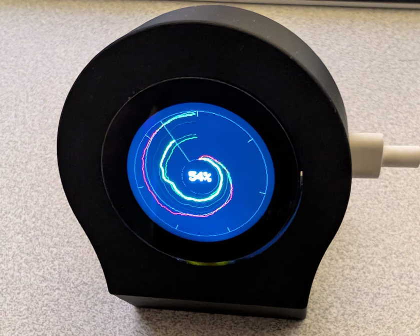

# Claude Watch

An ESP32-S3 device that monitors your Anthropic API usage in real time on a round display.



Built with a [Seeed Studio XIAO ESP32-S3](https://wiki.seeedstudio.com/xiao_esp32s3_getting_started/) and [Round Display](https://wiki.seeedstudio.com/get_start_round_display/) (GC9A01 240x240 LCD + CHSC6X touch).

## Hardware

### BOM

| Part | Link |
|------|------|
| Seeed XIAO ESP32-S3 | [seeedstudio.com](https://www.seeedstudio.com/XIAO-ESP32S3-p-5627.html) |
| 1.28" Round Touch Display | [seeedstudio.com](https://www.seeedstudio.com/1-28-Round-Touch-Display-for-Seeed-Studio-XIAO-ESP32.html) |
| microSD card (any size) | — |

### Specs

- **MCU**: Seeed XIAO ESP32-S3 (dual-core 240MHz, 320KB SRAM, 8MB flash)
- **Display**: 1.28" round GC9A01 LCD, 240x240 RGB565
- **Touch**: CHSC6X capacitive touch controller (I2C)
- **Storage**: microSD card (SPI, shared bus with LCD)

### Pin Map

| Function | GPIO |
|----------|------|
| SPI SCK  | 7    |
| SPI MOSI | 9    |
| SPI MISO | 8    |
| LCD CS   | 2    |
| LCD DC   | 4    |
| LCD BL   | 43   |
| SD CS    | 3    |
| I2C SDA  | 5    |
| I2C SCL  | 6    |
| Touch INT| 44   |

## Building

Requires [PlatformIO](https://platformio.org/).

```bash
make build        # compile
make flash        # upload to device
make monitor      # serial monitor
make flash-monitor  # flash + monitor
make clean        # clean build
make fullclean    # remove .pio entirely
make menuconfig   # ESP-IDF menuconfig
```

## Device Setup

### 1. WiFi Provisioning

On first boot (or after WiFi reset), the device starts a captive portal:

- The display shows a **QR code** encoding the AP credentials
- Scan the QR with your phone to connect to the device's WiFi
- The captive portal opens automatically — select your WiFi network, timezone, and fetch interval
- The device reboots and connects to your WiFi

### 2. Anthropic Login (OAuth)

Once connected to WiFi, the device needs authorization to access your Anthropic usage data:

- Tap the display to cycle to the **clock view**
- Tap the **WiFi button** (bottom of screen) to show the settings QR code
- Scan the QR or open `http://<device-ip>` in a browser
- Click **"Login with Anthropic"** — authenticate in your browser
- Copy the authorization code and paste it in the settings page
- Click **Authorize** — the device exchanges the code for its own OAuth tokens

The device gets its own refresh token via PKCE — your Claude Code credentials are not affected.

### 3. Settings Page

Accessible at `http://<device-ip>` when connected to the same WiFi:

- **WiFi SSID/Password**: change WiFi network
- **Timezone**: select your timezone
- **Fetch Interval**: how often to poll the API (1–30 min)
- **OAuth Login**: authorize the device with your Anthropic account
- **Reset WiFi & Reboot**: erase WiFi credentials and restart provisioning

## Display Views

Tap the screen to cycle between views:

### Values View

Shows current API usage:
```
Claude Usage
5h: 12%
reset Apr 8 16:00
7d: 23%
reset Apr 10 06:00
tap: graph
```

### Polar Graph View

A radar-style polar graph mapping 7 days onto a full circle:

- **North (12 o'clock)** = billing period reset time
- **Center** = 0% usage, **edge** = 100%
- **Clockwise** winding, one full rotation = 7 days
- **Burn-rate spiral** (gray): ideal linear consumption from 0% to 100%
- **Green** segments: under the burn rate
- **Red** segments: over the burn rate
- **5 weeks** of history with progressive dimming (newest = brightest)
- **Now line** (gray): current time position
- Current usage percentage displayed at center

### Clock View

Shows date and time in ISO format, updated every second:
```
2026-04-08
14:32:05
```

A **WiFi button** (blue circle, bottom) provides:
- **Short tap**: show settings page QR code
- **Long press (3s)**: erase WiFi credentials and reboot

## Architecture

### Components

| Component | Purpose |
|-----------|---------|
| `gc9a01` | GC9A01 LCD driver (SPI) |
| `chsc6x` | CHSC6X touch driver (I2C) |
| `display_text` | 5x7 bitmap font renderer |
| `qr_display` | QR code generator and display |
| `wifi_manager` | WiFi provisioning, captive portal, settings web server, OAuth PKCE |
| `api_client` | Anthropic API client with automatic token refresh |
| `usage_store` | SD card CSV storage with lazy mount/unmount |
| `polar_graph` | Strip-based polar graph renderer with double-buffered DMA |
| `dns_server` | Captive portal DNS redirect |

### SPI Bus Sharing

The LCD and SD card share the same SPI bus (SPI2). To avoid ISR race conditions ([espressif/esp-idf#17860](https://github.com/espressif/esp-idf/issues/17860)):

- A single **display task** owns the SPI bus — all LCD and SD operations go through a FreeRTOS queue
- SD card uses **lazy mount/unmount** (mount, write, unmount) to avoid keeping two SPI devices active simultaneously
- The polar graph uses **double-buffered strip rendering** (two 19KB DMA buffers alternated) to prevent async DMA from reading freed memory

### Data Flow

```
Auto-fetch timer (10min)
       |
  fetch_usage_task ──HTTP──> Anthropic API
       |
  DISP_MSG_USAGE ──queue──> display_task
                               |
                    ┌──────────┼──────────┐
                    v          v          v
              SD card write  LCD draw   Graph render
              (mount/write/  (values    (read SD +
               unmount)       screen)    polar plot)
```

## Importing Historical Data

If you have usage history from `claude-monitor` (the Python-based monitor), you can import it to the SD card:

```bash
python3 scripts/convert_usage.py sd_output
```

This reads `~/.claude-usage/*.jsonl` and generates CSV files in `sd_output/ccusage/`. Copy the `ccusage/` folder to the SD card root.

## License

MIT
